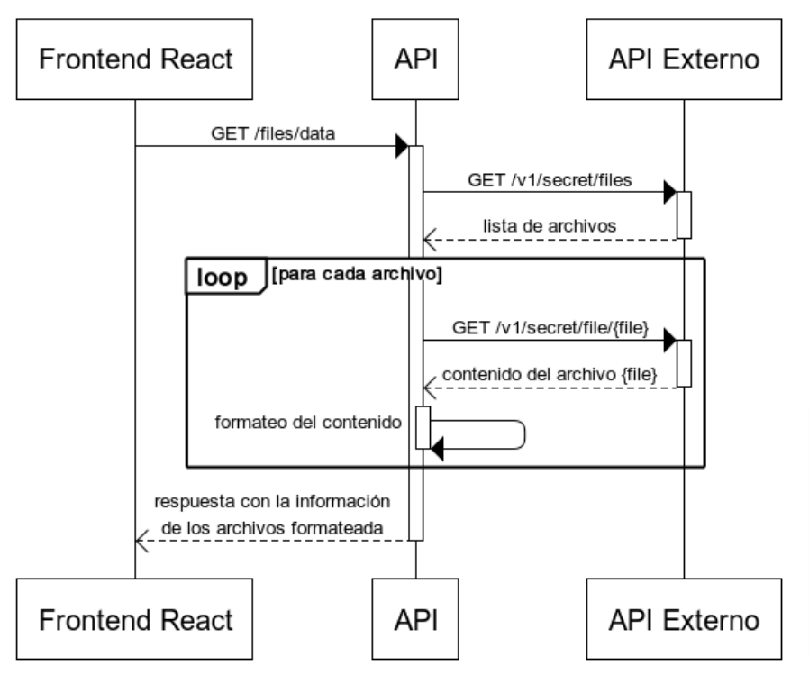

# Prueba Técnica Full Stack

## Diagrama del ejercicio

> [Enunciado](https://cs1.ssltrust.me/s/YeaQjE8XFljaMxv)

> [API desplegada](https://toolbox-challenge-api.vercel.app/api/files/data)

> [Frontend desplegado](https://toolbox-challenge.vercel.app)

## Herramientas

El repositorio es un monorepo que incluye el backend (`packages/api`) y el frontend (`packages/app`).

En el backend se utilizó:

- [express](https://expressjs.com/es/)
- [nodemon](https://nodemon.io/) - para reiniciar el servidor automaticámente cuando hay cambios en los archivos
- [node-fetch](https://www.npmjs.com/package/node-fetch) - para llamar a la API externa
- [chai](https://www.chaijs.com/) - para el test del servidor
- [mocha](https://mochajs.org/) - para el test del servidor

En el frontend se utilizó:
- [react](https://es.reactjs.org/)
- [vite](https://vitejs.dev/) - para transpilar y empaquetar el jsx de react
- [bootstrap](https://getbootstrap.com/) y [react-bootstrap](https://react-bootstrap.github.io/) - para estilar
- [jest](https://jestjs.io/) - para los tests unitarios

> Se desarrolló usando node v16.18.0.

## Desarrollo en local

1. Clonar o [forkear](https://github.com/marsidev/toolbox-challenge/fork) el repositorio
2. `npm install`
3. `npm run dev`

> El frontend se ejecuta en el puerto [3000](http://localhost:3000/)

> La API se ejecuta en el puerto [3001](http://localhost:3001/api/files/data)

## Scripts disponibles

- `npm run dev` - ejecuta la API y la aplicación de React de forma paralela, en un entorno de desarrollo
- `npm run test` - ejecuta los tests de la API y de la aplicación de React de forma paralela
- `npm run build` - realiza el build de la aplicación de React
- `npm run start` - ejecuta la aplicación de React en modo de producción (se debe hacer el `build` primero)
- `npm run api:dev` - ejecuta la API en un entorno de desarrollo, se reinicia automáticamente cuando se realizan cambios en los ficheros
- `npm run api:start` - ejecuta la API en modo de producción
- `npm run api:test` - ejecuta los tests de la API
- `npm run api:test:watch` - ejecuta los tests de la API, se reinician automáticamente cuando se realizan cambios en los ficheros
- `npm run app:dev` - ejecuta la aplicación de React en un entorno de desarrollo, se actualiza automáticamente cuando se realizan cambios en los ficheros
- `npm run app:start` - igual que `npm run start`
- `npm run app:test` - ejecuta los tests unitarios de la aplicación de React
- `npm run app:test:watch` - ejecuta los tests de la aplicación de React, se reinician automáticamente cuando se realizan cambios en los ficheros
